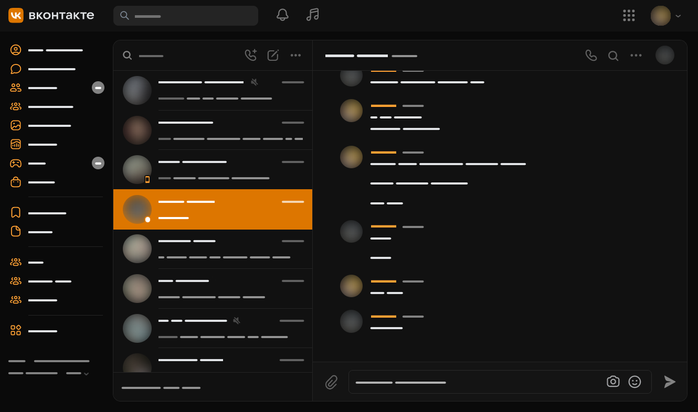

## VK theme generator for Firefox `userContent.css`
VK theming without bloat and extensions. 

- **Only works for dark theme**. 
- Makes everything darker. 
- Changes accent color.
- Fixes VK's coloring issues (image upload progress bar).

### How to use

1. Clone the repo
2. `python usercontent_vk_theme.py <hex accent color>`
3. Copy output to the `userContent.css` file in your profile folder
